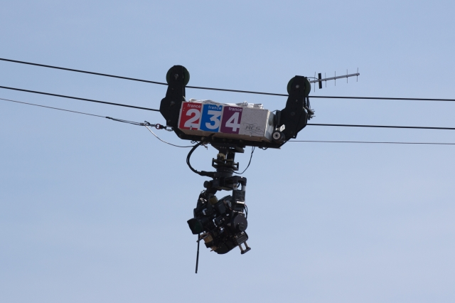

# Rope Trolley

This is a planning document for a November 2020 group project at Fox.Build.

We're going to build a remotely operated trolley that travels along an overhead rope. It will be very similar to a [DIY cable cam](https://youtu.be/Ao-e1Lg6lMY?t=37).

# Goals

 * Explore embedded Linux development with [Nerves](https://www.nerves-project.org/) (It's OK if you've never used Nerves before).
 * Share our experience with others.
 * Have fun. At no point will we discuss the practical merits of this project. This policy will be enforced by aircraft.
 * Have a display-worthy thing to display in the front window of the space (stretch goal).

# Hard Requirements

 * The device will be _remotely_ operated over the Internet (as opposed to a LAN, cables, radio, etc..)
 * The device will have _at least one actuator_. Right now, that's a servo, but if you have a creative alternative, that's fine too. Other ideas: Make it an art sculpture with remote controlled LEDs, smoke, speakers, etc..
 * The device will have a hilarious name, ideally one based on an absurd acronym or something.
 * The device will run [Nerves](https://www.nerves-project.org/), an embedded Linux development framework.
 * The device will use a _DC motor_ (no steppers for this one, OK?)
 * Operator will see a livestream from the device using an off-the-shelf webcam (no Pi cams)
 * Operator can remotely control the actuator
 * Operator can remotely move the device in both directions of the cable

# Soft Requirements

 * Having an artistic, aesthetically appealing or fun exterior would be nice, as it would allow us to keep it on display in the front window as a member project showcase.

# Similar Projects, Ideas

 * [Low Tech Magazine Article About Aerial Ropeways](https://www.lowtechmagazine.com/2011/01/aerial-ropeways-automatic-cargo-transport.html)
 * [High Wire Robot](https://www.cbc.ca/news/canada/newfoundland-labrador/high-wire-robot-1.5277840)
 * [Tin Can Cable Car](https://www.youtube.com/watch?v=a9nWG5ZD03o&app=desktop)
 * [Louden Hay Carrier](https://www.youtube.com/watch?v=UE8rHwD9eQ0&feature=youtu.be&t=96)

# How You Can Get Involved

We need help with:

 * Software development
 * Design and engineering
 * Documenting the process (photos, documentation, blogs, etc..)
 * Art (project graphics, sculptures for the project body)
 * Other things

Please contact Rick if you would like to get involved. #ropeTrolley on Fox.Build Slack.
https://foxbuild.slack.com/archives/C01D2JA4LG6
